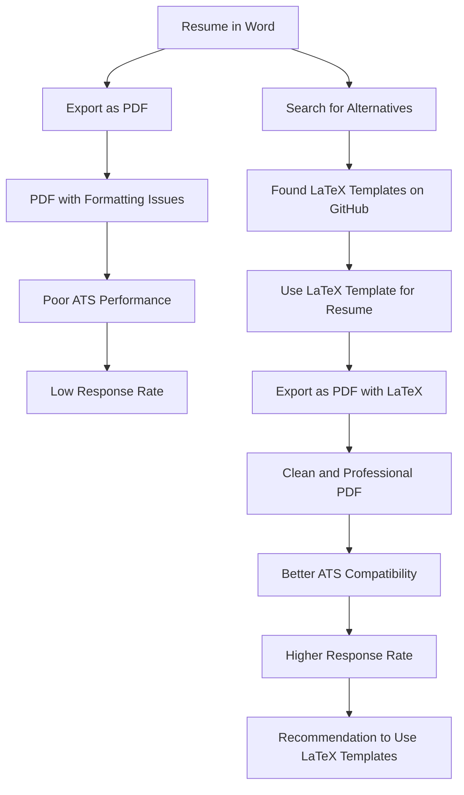

# Resume template

I used to make my resume with word and then convert to PDF. For some reason, sometimes it would treat some sections on my resume as an image and wouldn't let me highlight any word, which really messed up my resume when it went through ATS (Application Tracking System).

LaTex resumes are very clean. Not only it is better than converting DOC to PDF, but also it has a clean and simple. I highly recommend to use a LaTeX template than making your own resume! Here is am amazing resume template:

- ### [https://github.com/jakegut/resume](https://github.com/jakegut/resume)

## Why Using Word for Resumes is Not Recommended

Creating resumes in Microsoft Word might seem like a convenient choice due to its familiarity and ease of use. However, it comes with several drawbacks, especially in the context of job applications processed by Applicant Tracking Systems (ATS).

- formatting issues
- Inconsistent Display
- ATS Compatibility

## Why LaTeX is a Superior Choice

LaTeX is a typesetting system commonly used for producing scientific and technical documents. It excels in creating documents that are both aesthetically pleasing and functionally robust, making it an ideal choice for resume creation.

- Precise Formatting
- Professional Appearance
- Better ATS Compatibility

## [Overleaf](https://www.overleaf.com)

An online LaTeX editor that's easy to use. No installation, real-time collaboration, version control, hundreds of LaTeX templates, and more.

## How to Use Overleaf for Your Resume

To use Overleaf, visit [Overleaf website](https://www.overleaf.com) and sign up for a free account. Overleaf is cloud-based, so you don’t need to install anything on your computer.

Use the templete of your choice and make required changes. You can download the PDF file directly from the overleaf editor.