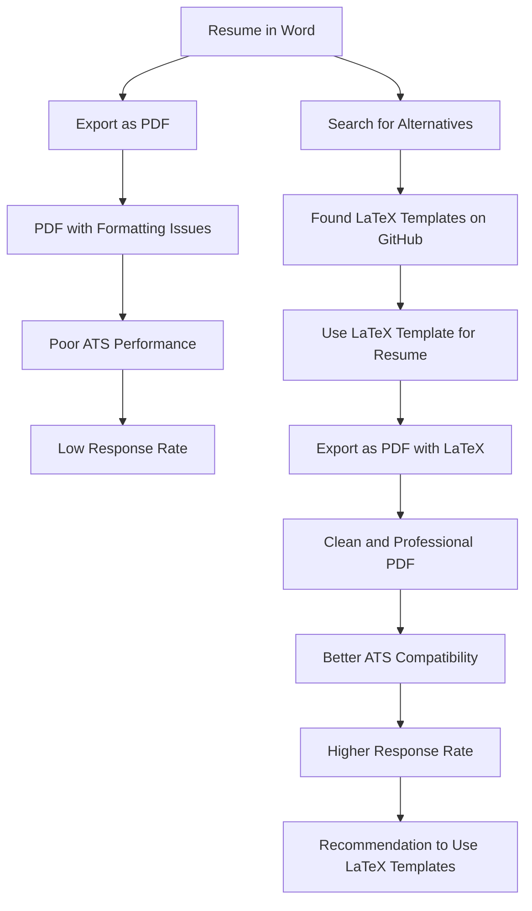

# Resume template

I used to make my resume with word and then convert to PDF. For some reason, sometimes it would treat some sections on my resume as an image and wouldn't let me highlight any word, which really messed up my resume when it went through ATS (Application Tracking System).

LaTex resumes are very clean. Not only it is better than converting DOC to PDF, but also it has a clean and simple. I highly recommend to use a LaTeX template than making your own resume! Here is am amazing template:

- [https://github.com/jakegut/resume](https://github.com/jakegut/resume)

## [Overleaf](https://www.overleaf.com)

An online LaTeX editor that's easy to use. No installation, real-time collaboration, version control, hundreds of LaTeX templates, and more.

